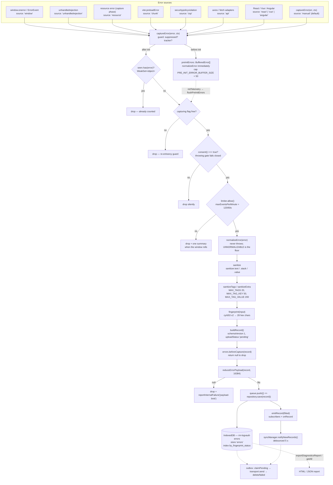
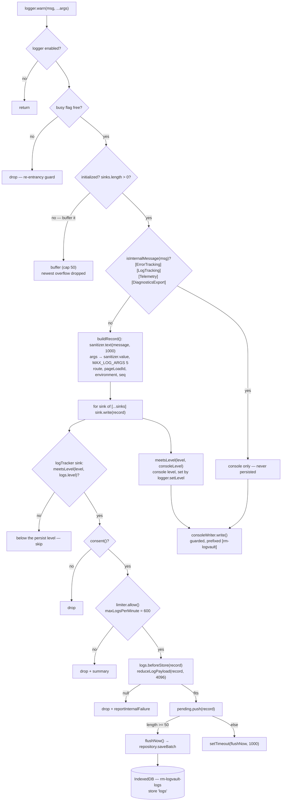
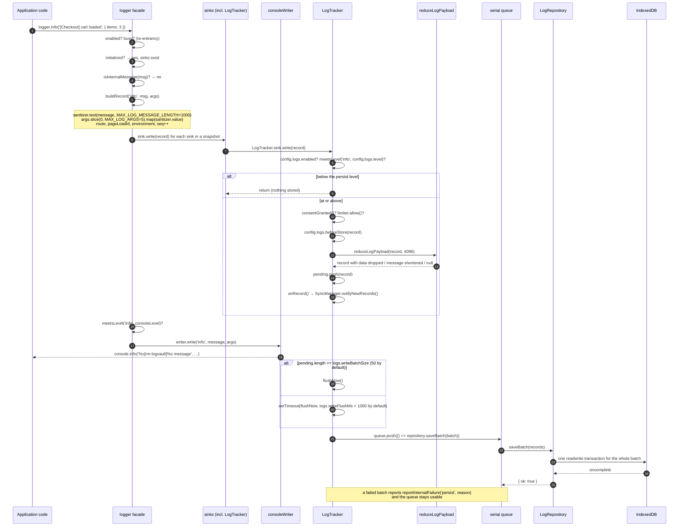
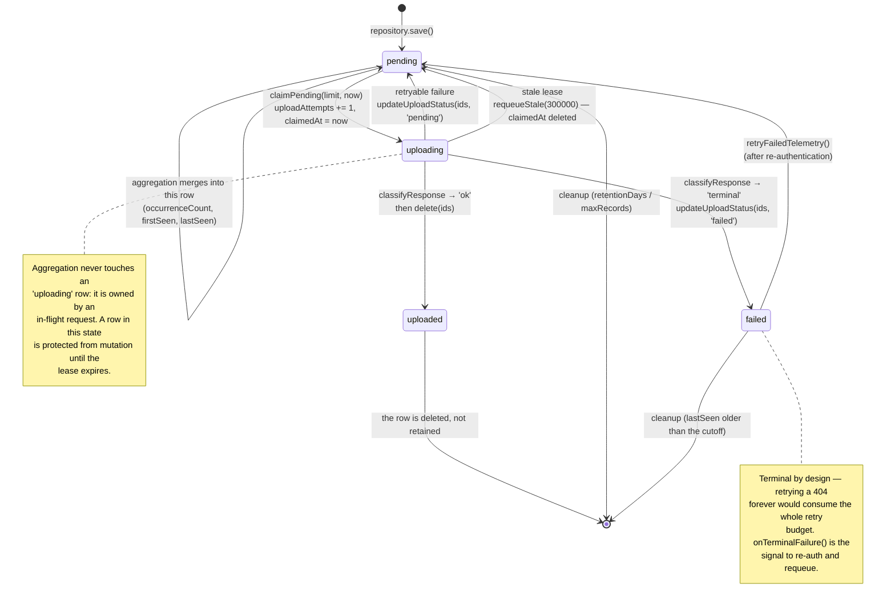
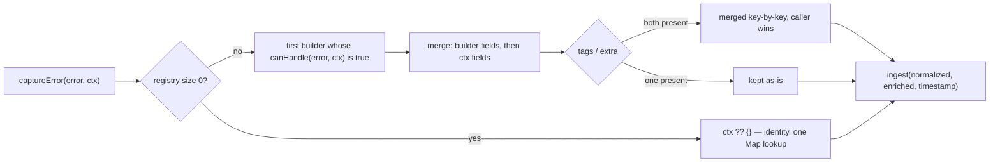
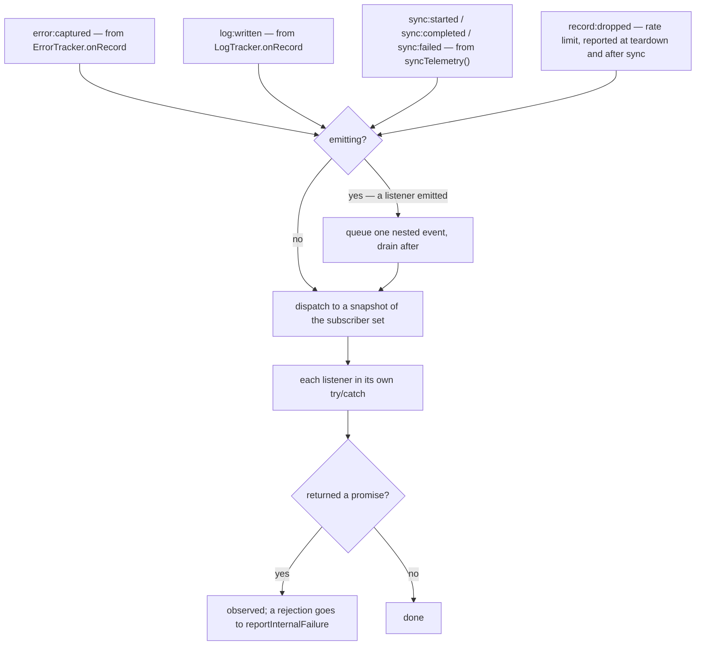
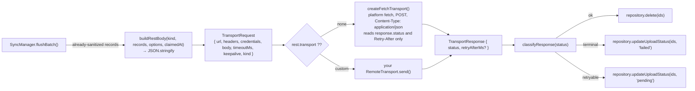
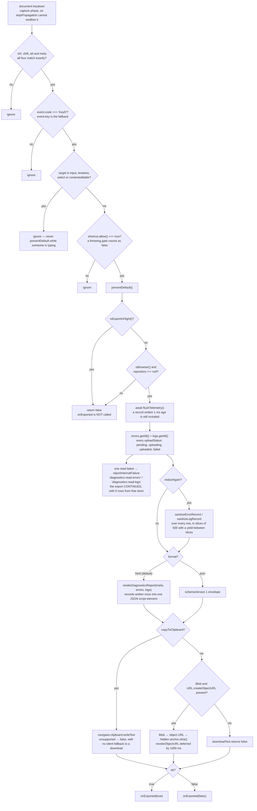
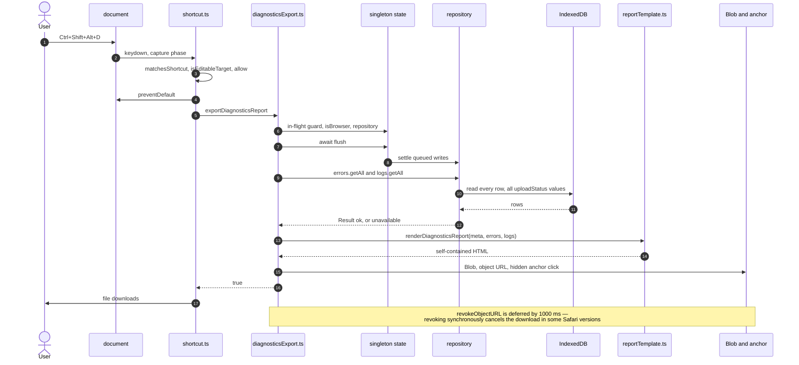

# Architecture

How a thrown value becomes a row in IndexedDB, and how that row becomes an HTTP request, a
diagnostics report, or nothing at all.

Everything here is derived from `src/`. Function and constant names are the real ones, so every
claim is greppable.

---

## 1. Module layout

```text
src/
├─ index.ts                     the complete public surface (explicit named re-exports only)
├─ core/
│  ├─ config.ts                 TelemetryOptions, DEFAULT_OPTIONS, resolveOptions, databaseNames
│  ├─ init.ts                   initTelemetry, setupTelemetry, destroyTelemetry, flush/sync/status
│  ├─ state.ts                  the globalThis[Symbol.for('logvault@1')] singleton + CleanupRegistry
│  ├─ events.ts                 createEventEmitter: the throwing-proof observer surface
│  ├─ env.ts                    feature-detected global access, fromEnv, isBrowser, isOnline
│  ├─ page.ts                   currentPageInfo, currentRoute, currentEnvironment
│  ├─ ids.ts                    newId, newPageLoadId, unfingerprintedId
│  ├─ internal.ts               reportInternalFailure / reportInternalNote (once per stage)
│  ├─ queue.ts                  createSerialQueue
│  ├─ rateLimit.ts              createRateLimiter (fixed 60 s window)
│  └─ types.ts                  Maybe, Timestamp, UploadStatus, RecordKind, Result
├─ errors/
│  ├─ captureError.ts           captureError + ErrorTracker (the single ingestion point)
│  ├─ normalize.ts              normalizeError: anything → NormalizedError
│  ├─ sanitize.ts               createSanitizer: the security boundary
│  ├─ contextBuilders.ts        registerErrorContextBuilder: app knowledge, injected
│  ├─ builtinContextBuilders.ts http / timeout / type-error builders (nothing self-registers)
│  ├─ apiContext.ts             buildApiErrorContext / buildFetchErrorContext / markAuthError
│  ├─ fingerprint.ts            fingerprint, cyrb53, normalizePathForFingerprint
│  ├─ payload.ts                byteLength, reduceErrorPayload, reduceLogPayload
│  ├─ constants.ts              REDACTED, every pattern and every limit
│  └─ types.ts                  ErrorRecord, ErrorSource, ErrorContext, …
├─ logger/
│  ├─ logger.ts                 the facade, sink dispatch, pre-init buffer, re-entrancy flag
│  ├─ sinkRegistry.ts           named sinks: list, look up, detach by key
│  ├─ logTracker.ts             the persist-level sink, batching, persist rate limit
│  ├─ consoleWriter.ts          the only module allowed to touch console.*
│  ├─ consoleCapture.ts         opt-in console.warn/error wrapper
│  └─ logger.constants.ts       level ladder, priorities, reserved prefixes, batch sizes
├─ handlers/globalHandlers.ts   onerror (chained), unhandledrejection, resources, CSP, Vite
├─ storage/
│  ├─ idbCore.ts                createDbConnection: never-throwing, self-healing IDB wrapper
│  ├─ errorRepository.ts        errors store: pending-only aggregation, atomic claim
│  ├─ logRepository.ts          logs store: batched insert, no aggregation
│  ├─ repositoryUtils.ts        cleanupStore, deleteByIds, updateStatuses, sortNewestFirst
│  ├─ encryption.ts             EncryptionProvider + the encrypting repository wrapper
│  ├─ index.ts                  the `/storage` subpath entry point
│  ├─ validate.ts               isErrorRecord / isLogRecord: malformed rows are deleted
│  ├─ storage.constants.ts      db versions, store names, index names, chunk sizes
│  └─ storage.types.ts          ErrorRepository, LogRepository, TelemetryRepository, StorageResult
├─ sync/
│  ├─ syncManager.ts            the outbox: claim → send → mark, backoff, one run at a time
│  ├─ restSync.ts               resolveEndpoint, classifyResponse, buildRestBody
│  ├─ remoteTransport.ts        the default fetch transport (the only network egress)
│  └─ sync.types.ts             RemoteTransport, TERMINAL_STATUSES, backoffDelay, parseRetryAfter
├─ export/
│  ├─ shortcut.ts               the capture-phase Ctrl+Shift+Alt+D listener
│  ├─ diagnosticsExport.ts      flush → getAll → render → Blob → download (html/json/jsonl/csv)
│  ├─ reportTemplate.ts         escapeHtml, escapeJsonText, renderDiagnosticsReport
│  └─ redactRecords.ts          sanitizeErrorRecord / sanitizeLogRecord (second pass)
├─ http.ts                      the `/http` subpath entry point
├─ adapters/
│  ├─ http.ts                   the HTTP client contract (types, classification, error context)
│  ├─ httpFetch.ts              createFetchHttpClient: the shipped implementation
│  ├─ auth.ts                   AuthProvider, auth header provider, auth interceptor
│  ├─ descriptors.ts            the frozen ADAPTERS table (metadata, no runtime registry)
│  └─ react.tsx, vue.ts, angular.ts, axios.ts, fetch.ts, reactQuery.ts
└─ testing/                     memoryRepository.ts, fakeTransport.ts, index.ts
```

The dependency direction is deliberately acyclic: `index → {core, errors, logger, handlers,
storage, sync, export}`, `captureError → {normalize, sanitize, fingerprint, payload, page, queue,
rateLimit, contextBuilders}`, `sanitize → env`, `page → {env, sanitize}`. Nothing in `core/` imports a
framework. `captureError` **reads** the context-builder registry but the registry does not import it,
so the registration path stays one-directional and there is no cycle.

The HTTP client is the one place a public function is allowed to reject — an HTTP client that cannot
report a failure is useless. It is walled off from the capture path: nothing in `core/`, `errors/`,
`storage/`, `sync/` or `export/` imports `adapters/http.ts`, and `httpFetch.ts` reaches only
`core/internal.js` and `adapters/http.js`. That is what keeps the never-throw guarantee at I-1 true
for the telemetry pipeline while the client behaves like a normal one.

---

## 2. The capture pipeline



### Where the gates actually sit

The order above is the code order, and two placements matter:

- **Consent is checked inside `ingest`**, after the identity and re-entrancy guards but before
  normalisation output is turned into a record. A denial drops the error silently — nothing is
  stored, and nothing is buffered either, because the pre-init path is a separate branch that only
  runs before a tracker exists.
- **The rate limiter is checked after consent.** A denial by `consent()` therefore does not consume
  rate-limit budget.

`ingest` returns early for `destroyed` and for `!config.errors.enabled` before any of this, so a
disabled installation does no work at all.

### The log pipeline, contrastingly

Logs take a different path because they are high-volume. The `logger` facade builds a `LogRecord`
and hands it to every sink, and the logVault sink is the log tracker:



Note the two independent thresholds in one diagram: `config.logs.level` filters **persistence**,
`consoleLevel` filters **output**, and sinks run before the console filter. That ordering is what
makes `logger.setLevel('off')` silence the console without silencing storage.

The destination does not depend on the level either. `logger.error(...)` travels exactly this path and
lands in `rm-logvault-logs`, because it is a `LogRecord` carrying `level: 'error'` — not an
`ErrorRecord`. An `ErrorRecord`, and therefore a row in `rm-logvault-errors`, comes only from
`captureError`, the framework adapters and the global handlers in [§2](#2-the-capture-pipeline). The
two record kinds exist because they behave differently: error rows aggregate on `fingerprint` while
pending, log rows are appended one per call.

`PRE_INIT_LOG_BUFFER_SIZE` is 50. The write batch size and flush interval default to 50 records and
1000 ms — the values of `LOG_FLUSH_BATCH_SIZE` and `LOG_FLUSH_INTERVAL_MS`, which a consumer can
override with `logs.writeBatchSize` and `logs.writeFlushMs`. Both are durability knobs: a buffered log
reaches IndexedDB when the batch fills or when the interval elapses, whichever comes first.
The first sink to be registered triggers `replayPreInit()`, which re-emits the buffered calls with
`replaying = true` so they are not buffered a second time.

---

## 3. One error, end to end

```mermaid
sequenceDiagram
    autonumber
    participant App as Application code
    participant W as window (error event)
    participant GH as globalHandlers
    participant CE as captureError
    participant ET as ErrorTracker
    participant SZ as sanitizer
    participant FP as fingerprint
    participant PL as reduceErrorPayload
    participant Q as serial queue
    participant ER as ErrorRepository
    participant IDB as IndexedDB
    participant SM as SyncManager

    App->>W: throws inside a listener
    W->>GH: ErrorEvent fires
    Note over GH: globalOnerror() is chained:<br/>previous handler called, its return value returned
    GH->>CE: onError(error, { source: 'window', location })
    CE->>CE: suppressed? → no
    CE->>CE: activeTracker !== null → yes
    CE->>ET: tracker.capture(error, ctx)
    ET->>ET: seen.has(error)? no → seen.add(error)
    ET->>ET: acquire() → capturing = true
    ET->>ET: normalizeError(error)
    Note over ET: never throws; hostile Proxy,<br/>circular cause, AggregateError all handled
    ET->>ET: ingest(normalized, ctx, now())
    ET->>ET: config.errors.enabled? consent()? limiter.allow()?
    ET->>SZ: sanitizer.text(name), .text(message), .stack(stack)
    SZ-->>ET: bounded, redacted strings
    ET->>ET: sanitizeTags(), sanitizeExtra()
    ET->>FP: fingerprint({ source, category, name, message, stack, route, api, event, location })
    FP-->>ET: 28-char hex fingerprint
    ET->>ET: buildRecord() → schemaVersion 1, uploadStatus 'pending'
    ET->>ET: errors.beforeCapture(record)
    ET->>PL: reduceErrorPayload(record, 16384)
    PL-->>ET: record that fits, or null → reportInternalFailure
    ET->>Q: queue.push(() => repository.save(record))
    Note over ET,Q: the promise is intentionally not awaited —<br/>captureError is synchronous and must not touch IDB
    ET->>ET: emitRecord(record) → subscribers, then onRecord
    ET->>ET: capturing = false
    CE-->>GH: returns (void)
    GH-->>W: returns the chained handler's value

    Q->>ER: save(record)
    ER->>IDB: readwrite transaction
    ER->>IDB: index('by_fingerprint_status').get([fp, 'pending'])
    alt a pending row with this fingerprint exists
        ER->>IDB: put({ ...existing, occurrenceCount + 1, firstSeen: min, lastSeen: max })
    else no pending row
        ER->>IDB: put(record)
    end
    Note over ER,IDB: an 'uploading' row is never touched —<br/>it belongs to an in-flight request
    IDB-->>ER: transaction oncomplete
    ER-->>Q: { ok: true }

    ET->>SM: onRecord() → notifyNewRecords()
    Note over SM: debounced 5 s; ignored while a run is<br/>in flight or while backing off
```

If storage writes fail with `quota`, the repository halves the cap, runs cleanup, and retries the
same write exactly once before giving up.

---

## 4. One log batch



The tracker also flushes on `pagehide` and on `visibilitychange → hidden`, because those are the
last moments a browser reliably lets a page write.

---

## 5. Offline → online recovery

```mermaid
sequenceDiagram
    autonumber
    participant App as Application
    participant SM as SyncManager
    participant ER as ErrorRepository
    participant IDB as IndexedDB
    participant TR as transport (fetch)
    participant API as Your endpoint
    participant W as window 'online'

    Note over App,SM: the user is offline; capture keeps working
    Note over SM: every run starts with consentGranted();<br/>a refusal returns stopped: true with no claim and no request
    App->>ER: save(record) → uploadStatus 'pending'
    ER->>IDB: put

    SM->>SM: schedule(intervalMs)
    SM->>SM: flush()
    SM->>SM: runFlush(): isOnline() === false
    SM->>SM: currentStatus = 'offline'
    Note over SM: summaries returned with stopped: true;<br/>no claim, no request, no failure counted

    Note over W: connectivity returns
    W->>SM: 'online' event
    SM->>SM: schedule(5000)

    SM->>SM: runFlush(): isOnline() === true → currentStatus 'running'
    loop up to MAX_BATCHES_PER_FLUSH = 10
        SM->>ER: claimPending(batchSize = 50, now)
        ER->>IDB: readwrite: walk by_status='pending',<br/>rewrite each to 'uploading', claimedAt = now, uploadAttempts + 1
        IDB-->>ER: claimed rows
        ER-->>SM: ErrorRecord[]
        SM->>SM: buildRestBody('errors', records, options, claimedAt)
        SM->>TR: send({ url, headers, credentials, body, timeoutMs, keepalive, kind })
        TR->>API: POST /telemetry/errors
        API-->>TR: 202
        TR-->>SM: { status: 202 }
        SM->>SM: classifyResponse(202) → 'ok'
        SM->>ER: delete(ids)
        ER->>IDB: readwrite delete
    end
    SM->>SM: failures = 0, currentStatus = 'ok', lastSyncAt = now()
    SM->>SM: schedule(intervalMs)

    Note over SM,ER: recovery of a claim orphaned by a closed tab
    SM->>SM: start() → requeueStale() before the first schedule
    SM->>ER: requeueStale(CLAIM_LEASE_MS = 300000, now)
    ER->>IDB: rows with uploadStatus 'uploading' and<br/>claimedAt missing or older than 5 min → 'pending' (claimedAt deleted)
```

### Failure branches in the same run

| Branch                 | Trigger                                  | Repository action                                                         | Next attempt                                  |
| ---------------------- | ---------------------------------------- | ------------------------------------------------------------------------- | --------------------------------------------- |
| Terminal               | A status in `TERMINAL_STATUSES`          | `updateUploadStatus(ids, 'failed')`; `onTerminalFailure(status, records)` | Not automatic — only `retryFailedTelemetry()` |
| Retryable status       | `408`, `429`, any non-terminal non-2xx   | `updateUploadStatus(ids, 'pending')`                                      | `max(backoffDelay(failures), retryAfterMs)`   |
| Transport rejection    | `send()` threw (network, abort, timeout) | `updateUploadStatus(ids, 'pending')`                                      | Same backoff                                  |
| Headers provider threw | `rest.getHeaders()` rejected             | `updateUploadStatus(ids, 'pending')`                                      | Same backoff — explicitly **not** terminal    |
| Claim failed           | IndexedDB error                          | none                                                                      | Run stops with `stopped: true`                |
| Nothing left           | `claimPending` returned `[]`             | none                                                                      | Treated as "done", not as a failure           |

`backoffDelay(failureCount)` is `min(15000 * 2^(failures-1), 900000)`, so 15 s → 30 s → 60 s,
capped at 15 minutes. `retryAfterMs` is parsed from the `Retry-After` header on **any** response
and clamped to `[0, 900000]`.

`notifyNewRecords()` deliberately never pulls a run forward while a run is in flight or while the
failure counter is non-zero: hammering a failing endpoint with one request per error is exactly
what the backoff exists to prevent.

---

## 6. `uploadStatus` lifecycle



`uploaded` is a transient state in practice: a 2xx deletes the row, so an `uploaded` row normally
only exists if the delete itself failed (reported as `delete-after-upload`). The union still
includes it because `UploadStatus` is part of the persisted schema.

`pendingCount()` counts `pending` **plus** `uploading`, so a batch claimed right now still shows up
as work in flight.

---

## 7. The load-bearing mechanisms

### 7.1 The dual-copy `Symbol.for('logvault@1')` guard

**Where:** `src/core/state.ts` (`getState`, `isTelemetryState`) and `SINGLETON_KEY` in
`src/errors/constants.ts`.

```ts
export const SINGLETON_KEY = Symbol.for('logvault@1');

function isTelemetryState(value: unknown): value is TelemetryState {
  return (
    value !== null &&
    typeof value === 'object' &&
    (value as { __logvaultState?: unknown }).__logvaultState === true
  );
}

/** Backfill members an older build may not have created. Repairs in place. */
function repairState(state: TelemetryState): TelemetryState {
  const mutable: Partial<TelemetryState> = state;
  if (mutable.errorTracker === undefined) mutable.errorTracker = null;
  if (!Array.isArray(mutable.preInitErrors)) mutable.preInitErrors = [];
  if (typeof mutable.captureSuppressed !== 'boolean') mutable.captureSuppressed = false;
  return state;
}

export function getState(): TelemetryState {
  if (cached !== undefined) return cached;
  try {
    const existing: unknown = Reflect.get(globalThis, SINGLETON_KEY);
    if (isTelemetryState(existing)) {
      cached = repairState(existing);
      return cached;
    }
  } catch {
    // Fall through and create a private instance.
  }
  const fresh = createState();
  try {
    Object.defineProperty(globalThis, SINGLETON_KEY, {
      value: fresh,
      writable: false,
      enumerable: false,
      configurable: false,
    });
  } catch {
    // A frozen globalThis is unusual but survivable.
  }
  cached = fresh;
  return cached;
}
```

**What it prevents.** Microfrontends and Module Federation routinely end up with two copies of the
same package in one page — different remote bundles, different vendor chunks, or simply two
versions of a dependency. Module-scoped state would then exist twice. Two copies would each install
`window.onerror`, each install the shortcut listener, each open the same IndexedDB database, and
each capture every error: every failure would appear twice in the report, and two log trackers
would double every log row.

`Symbol.for` is a **global symbol registry** key, so even two independent copies of the module —
which do not share a module scope but do share `globalThis` — resolve the same symbol and therefore
the same state object. The `__logvaultState: true` marker is a structural guard: a foreign library
happening to use the same symbol key would not be mistaken for logVault state.

Sharing the object is not sufficient on its own. The **error pipeline's mutable state** lives here
too — `errorTracker`, `preInitErrors` and `captureSuppressed` — rather than in module scope. The
adapter entries are separate bundles that inline their own copy of `src/errors/captureError.ts`
(`tsup.config.ts` sets `splitting: false` and marks only the framework peers `external`), so a
module-scoped tracker would leave an adapter dispatching into a slot its own copy can never fill:
`setErrorTracker` is reachable only from `initTelemetry`, which lives in the root entry. Rollup
proves the branch unreachable and reduces the dispatch to an empty statement — the capture is then
buffered into an array nothing ever drains, silently, because no operation failed. Reading the
tracker off the shared object is what makes any copy of the library resolve the one live tracker.

The property is defined with `writable: false, enumerable: false, configurable: false`, so the
first copy to run owns the state and a later copy cannot replace it. The local `cached` variable
keeps subsequent lookups cheap (no repeated `Reflect.get`).

**Consequences.** `resetState()` mutates the shared object in place rather than replacing it,
because other copies hold a live reference to it — which is also why it truncates `preInitErrors`
instead of assigning a fresh array. And every other guard in the library is written against this
shared state, not against module-level variables: `initTelemetry` checks `state.initialized`,
`getTelemetryStatus()` reads `state.pendingErrors`, and the fallback when `Object.defineProperty`
throws is a private instance (correct behaviour, just without cross-copy sharing).

`repairState` is what keeps two *versions* of the package co-existing. The first copy to call
`getState` installs the object and the property is `configurable: false`, so a newer copy cannot
replace a state object written by an older one that lacks these members. It backfills them in place
instead, because rejecting the object would hand this copy a private one and split capture in two.

One boundary is deliberate: the **logger facade** is still module-scoped, so two copies of the *root*
entry each have their own `logger` and their own sink list. No shipped subpath exports `logger`, so an
adapter can never reach the wrong one, and hoisting it would move the pre-init log buffer, the
console-capture wrapper and the sink list — a larger change with its own hazards.

### 7.2 The serial write queue

**Where:** `src/core/queue.ts` (`createSerialQueue`) — one instance per `ErrorTracker`, one per
`LogTracker`.

```ts
const push = <T>(task: () => Promise<T> | T): Promise<T | undefined> => {
  pending += 1;
  const run = tail.then(
    async () => {
      try {
        return await task();
      } catch {
        return undefined;
      } finally {
        pending -= 1;
      }
    },
    async () => {
      try {
        return await task();
      } catch {
        return undefined;
      } finally {
        pending -= 1;
      }
    },
  );
  tail = run.then(
    () => undefined,
    () => undefined,
  );
  return run;
};
```

Three properties:

1. **Strict ordering.** Each task is chained onto `tail`, so writes reach IndexedDB in the order
   they were captured. That matters for error aggregation: if two occurrences of the same
   fingerprint arrive back to back, the second must see the first's row to merge into it.
2. **One failure cannot poison the chain.** The rejection handler is duplicated onto both slots of
   `tail.then`, and the task body catches internally, so a failed write yields `undefined` and the
   next task still runs.
3. **A drain that is honest about late arrivals.** `drain()` compares `tail` before and after
   awaiting, and loops while it changed — so a task appended _while_ draining is still awaited.
   `flushTelemetry()` and `flush()` depend on that.

`clear()` replaces `tail` with a resolved promise and zeroes `pending`. Anything already executing
still completes; its result is simply no longer awaited. This is what `destroy()` uses to drop
queued work without hanging teardown.

### 7.3 The re-entrancy guard

There are three separate guards, because there are three separate recursion hazards.

**Error pipeline — `capturing` in `createErrorTracker`.** `captureError` cannot be allowed to
re-enter: an error raised inside sanitisation or inside `normalizeError` would otherwise start a
second capture, whose failure starts a third, and so on.

```ts
const acquire = (): boolean => {
  if (capturing) return false;
  capturing = true;
  return true;
};

capture: (error, ctx) => {
  try {
    ...
    if (!acquire()) return;
    try { ingest(normalizeError(error), ctx, ctx?.timestamp ?? now()); }
    finally { capturing = false; }
  } catch (failure) {
    capturing = false;
    reportInternalFailure('capture', failure);
  }
}
```

The flag is released in a `finally` _and_ in the outer catch, so a failure anywhere in the pipeline
cannot leave the tracker permanently mute.

**Logger — `busy` in `createLogger`.** Dispatch sets `busy = true` around sink iteration and the
console write. A sink that calls `logger.warn(...)`, or the wrapped `console.warn` being invoked
from inside the writer, hits `if (busy) return;` and is dropped rather than recursed into.

**Pre-init replay — `replaying`.** While `replayPreInit()` re-emits the buffered calls it sets
`replaying = true`, which suppresses the "buffer this" branch so replayed calls are dispatched
once, not re-buffered into an infinite loop.

There is a fourth, adjacent guard: **`isInternalMessage`**. A message beginning with
`[ErrorTracking]`, `[LogTracking]`, `[Telemetry]` or `[DiagnosticsExport]` is never turned into a
record. Without it, `reportInternalFailure('persist', …)` — emitted through the logger — would be
persisted, fail, and report itself again.

### 7.4 The rate limiter

**Where:** `src/core/rateLimit.ts` (`createRateLimiter`), one instance per tracker.

```ts
const limiter = createRateLimiter(config.errors.maxEventsPerMinute, (dropped) => {
  reportInternalNote('rate-limit', `${String(dropped)} dropped`);
});
```

A fixed 60-second window (`RATE_LIMIT_WINDOW_MS = 60_000`). `allow()` rolls the window on every
call and then either admits the event or increments `droppedCount`:

- **The summary is one line, not one line per drop.** `onWindowRoll` runs only when the window
  actually rolls _and_ at least one event was dropped. `reportInternalNote` routes it through the
  same once-per-stage suppression as `reportInternalFailure`, so a storm collapses to a single
  `[Telemetry] rate-limit: 8134 dropped` line.
- **Failing open is deliberate.** The `catch` in `allow()` returns `true`. Losing telemetry is worse
  than a burst; a limiter bug must not silently disable capture.
- **A non-positive or non-finite limit disables limiting entirely** (`limit = 0`), which is how
  `maxEventsPerMinute: 0` behaves as "off" rather than "block everything". Note the asymmetry with
  the option resolver: `positiveNumber` would normally reject `0` for `maxRecords`, but
  `maxEventsPerMinute` is resolved with `allowZero: true`.
- **`dropped()` and `admitted()` are observability**, surfaced as
  `getTelemetryStatus().droppedByRateLimit` (errors plus logs).

Defaults: `errors.maxEventsPerMinute` = 120, `logs.maxLogsPerMinute` = 600.

### 7.5 The identity `WeakSet`

**Where:** the `seen` set in `createErrorTracker`.

```ts
const seen = new WeakSet<object>();

// Layer (a) of deduplication: object identity.
if (error !== null && (typeof error === 'object' || typeof error === 'function')) {
  const object = error as object;
  if (seen.has(object)) return;
  seen.add(object);
}
```

**Why it exists.** The same `Error` instance legitimately reaches the library through several paths
at once. React 19 calls `onUncaughtError` _and_ the nearest boundary's `componentDidCatch`; a
failing `fetch` reaches the fetch wrapper _and_ `window.onerror`; an axios rejection reaches the
interceptor _and_ possibly an `unhandledrejection`. Without identity deduplication, a single bug
would produce three rows with the same fingerprint, `occurrenceCount` would be inflated, and the
report would be misleading.

**Why a `WeakSet` and not a `Set`.** The errors being remembered are application objects — possibly
large, possibly holding references to DOM nodes or stores. A `Set` would keep them alive for the
lifetime of the page, which is an unbounded memory leak in a library whose whole premise is
capturing _many_ errors. A `WeakSet` holds no strong reference, so an error becomes collectable as
soon as the application drops it. Membership is by reference identity, which is exactly the
question being asked.

**Its limits.** Primitives — thrown strings, numbers, `undefined` — cannot be weakly held, so they
are skipped by this check. That is fine: identical string throws are already collapsed by
**layer (b)**, fingerprint aggregation, which merges them into one row with a higher
`occurrenceCount`. The same applies to a _fresh_ `Error` object each time, which is the common case
for a handler that constructs `new Error('...')` on every call.

---

### 7.6 The observation and extension surface

Three seams let an application reach into the pipeline without the library learning anything about
the application. All three are opt-in and cost nothing when unset.

#### Context builders: knowledge flows in

`captureError` knows how to classify the shapes the library itself produces — an HTTP failure, a
chunk-load error, a CSP violation. It cannot know that `code === 'ALARM_NOT_FOUND'` is an
application-domain error, and it must not learn product vocabulary to find out.



Two properties are load-bearing:

- **The caller always wins.** A builder cannot override `source` on an explicit
  `captureError(err, { source: 'react' })`. Otherwise a registration made for one purpose would
  silently relabel an integration the application already described correctly.
- **`tags` and `extra` merge; everything else replaces.** They are additive by nature — a builder
  saying `{ domain: 'alarms' }` and a caller saying `{ flow: 'checkout' }` describe the same error
  from two angles. Letting one discard the other would lose information silently, and a scalar field
  has no equivalent ambiguity.

The registry is **process-wide and survives `destroyTelemetry`**, unlike the emitter. It describes
the application, not an installation, so a re-init after a hot reload must not lose the
classification. A failing `canHandle` is treated as "no match" and a failing `build` falls through to
the next builder, so a third-party classifier can never swallow a capture.

#### Events: state flows out

The library ships no state container — frameworks have their own, and picking one would be
gratuitous. It ships observation instead.



The re-entrancy rule is the one worth understanding. A listener on `error:captured` that itself calls
`captureError` would recurse without bound. Nested emissions are therefore **queued, not recursed**,
and the drain loop replaces the pending slot rather than appending to a queue — so a listener that
emits on every event terminates instead of spinning.

`initTelemetry` returns a **stable wrapper** as `handle.events`, not the per-installation emitter.
The wrapper delegates to whatever emitter is current, so a consumer that captured the handle once
keeps receiving events after a re-initialization. Before init and after teardown, subscriptions land
on a dormant emitter, so a listener registered at module load is not lost.

**Honest scope:** these events report `captureError` and `logger` activity and explicit
`syncTelemetry()` runs. The automatic background flush is internal and does not emit `sync:started`
or `sync:completed`, because those events are deliberately framed as "the pass you asked for".

#### The sink registry: sinks are listable

`logger.addSink(sink)` has always returned an unsubscribe function, which is enough to install one.
It is not enough to answer "which sinks are attached?" once an application has three. Sinks therefore
live in a `Map` behind the facade, and `getSinkRegistry()` exposes list, lookup and detach-by-key.

`addSink` remains **the** installation API — registering directly in the registry would bypass both
pre-init replay and the re-entrancy guard. The registry is introspection, not a second door.

---

## 8. Lifecycle

```mermaid
sequenceDiagram
    autonumber
    participant App as Application
    participant IT as initTelemetry
    participant S as global state
    participant SZ as default sanitizer
    participant R as TelemetryRepository
    participant ET as ErrorTracker
    participant LT as LogTracker
    participant GH as globalHandlers
    participant SM as SyncManager
    participant SC as shortcut

    App->>IT: initTelemetry({ appName: 'checkout' })
    IT->>S: state.initialized && active !== null?
    Note over IT,S: yes → return the existing handle, install nothing (idempotent)
    IT->>S: resetInternalFailures()
    IT->>IT: resolveOptions(options) → frozen ResolvedTelemetryOptions
    IT->>SZ: setDefaultSanitizer(createSanitizer({ extraSensitiveKeys, extraPatterns, allowedQueryParams }))
    IT->>S: createCleanupRegistry()

    alt enabled === false
        IT->>S: initialized = true, storageState = 'disabled', repository = null
        IT->>ET: setErrorTracker(null); setCaptureSuppressed(true)
        IT-->>App: disabledHandle() — capture is a no-op and buffers nothing
    else enabled
        IT->>ET: setCaptureSuppressed(false)
        IT->>R: options.repository ?? createIdbRepository(dbPrefix, …)
        IT->>S: storageState = 'initializing'
        IT->>R: initialize() → promise (NOT awaited)
        Note over R: one working database is enough;<br/>both failing means 'unavailable'
        IT->>ET: createErrorTracker({ repository, options, onRecord })
        IT->>LT: createLogTracker({ repository, options, onRecord })
        IT->>LT: logger.addSink(logTracker.sink) → first sink triggers replayPreInit
        opt options.logSource !== undefined
            IT->>LT: logSource.addSink(logTracker.sink) (detach registered for cleanup)
        end
        opt errors.enabled
            IT->>GH: installGlobalErrorHandlers({ …, onError: (e, ctx) => captureError(e, ctx) })
        end
        opt logs.enabled && logs.captureConsole
            IT->>LT: getLoggerController().setConsoleCapture(true)
        end
        opt options.shortcut !== false
            IT->>SC: installDiagnosticsExportShortcut({ key, ctrl, shift, alt, meta, target, allow, filenamePrefix, onExported })
        end
        IT->>SM: createSyncManager({ errors, logs, options, isStorageReady })
        IT->>SM: readyPromise.then(ok => ok && syncManager.start())
        Note over IT,SM: uploads never begin before storage can read the outbox
        IT->>S: cleanup.addListener(window, 'pagehide')<br/>cleanup.addListener(document, 'visibilitychange')
        IT->>S: initialized = true
        IT->>ET: flushPreInitErrors(errorTracker)
        IT->>LT: getLoggerController().replayPreInit()
        IT->>S: refreshPendingCounts() (fire and forget)
        IT-->>App: TelemetryHandle
    end

    App->>IT: destroyTelemetry()
    IT->>S: active = null, initialized = false
    IT->>ET: setErrorTracker(null)
    IT->>S: cleanup.run() — reverse registration order, each teardown guarded
    IT->>SM: dispose() — clear timers, remove the 'online' listener
    Note over IT: the flush + close are deferred because destroyTelemetry is synchronous
    IT->>ET: errorTracker.flush()
    IT->>LT: logTracker.destroy() — persist what is buffered, then stop
    IT->>R: repository.close()
    IT->>LT: getLoggerController().reset() — restore console, drop buffers
    IT->>SZ: resetDefaultSanitizer()
    IT->>ET: clearPreInitErrors()
    IT->>S: resetState()
```

### Why `initTelemetry` is idempotent

`if (state.initialized && active !== null) return active.handle;` is the first thing that runs. A
second call — from React Strict Mode, from HMR, from a microfrontend that also initialises, or from
a careless component — returns the existing handle and installs nothing. Reconfiguration therefore
requires `destroyTelemetry()` first, which is a deliberate trade: silently swapping configuration
under a live installation would mean two sanitizers, two sets of listeners and two sync managers
fighting over the same databases.

`destroyTelemetry()` is symmetric: idempotent, never throws, and it does the synchronous part
(removing listeners, stopping dispatch, disposing the sync manager) _before_ returning, so no
capture can occur after the call. The asynchronous part (flush, close) is deferred into a
floating promise whose every step is individually guarded.

---

## 9. Storage internals

### The connection

`createDbConnection` never throws. It has one rule: every fallible operation returns a
`StorageResult<T>` (`{ ok: true, value }` or `{ ok: false, reason }`), so the rest of the library
can degrade instead of breaking the host application.

It defends against the ways IndexedDB actually misbehaves:

| Hazard                                                | Defence                                                                                                                                                      |
| ----------------------------------------------------- | ------------------------------------------------------------------------------------------------------------------------------------------------------------ |
| `indexedDB` missing (SSR, old browser)                | `resolveFactory` returns `undefined` → `permanentlyUnavailable = true`, `reason: 'unavailable'`                                                              |
| Accessing `indexedDB` throws (Safari private mode)    | `resolveFactory` catches and returns `'blocked'`                                                                                                             |
| `open()` never settles (another tab holds an upgrade) | An open-timeout timer — `openTimeoutMs`, 5 000 ms by default (`DEFAULT_OPEN_TIMEOUT_MS`) — resolves the promise with `reason: 'transaction'`, and a late `onsuccess` closes the handle instead of leaking it |
| Concurrent opens                                      | A single in-flight `opening` promise is shared by every caller                                                                                               |
| Another tab upgrades the schema                       | `db.onversionchange` closes and drops our handle                                                                                                             |
| Storage cleared mid-session, or the connection dies   | `db.onclose` drops the handle; `ensureOpen()` re-opens on the next call and re-runs `upgrade`                                                                |
| A row cannot be structured-cloned                     | `classifyStorageError` maps `DataCloneError` to `'serialization'`                                                                                            |
| The origin is out of space                            | `QuotaExceededError` / `NS_ERROR_DOM_QUOTA_REACHED` / legacy code `22` → `'quota'`                                                                           |
| The store vanished (DB deleted by a tab)              | `db.transaction()` throwing drops the connection and re-classifies                                                                                           |
| A transaction auto-commits while awaiting a macrotask | Documented invariant: transaction bodies await only IDB requests                                                                                             |

For `readwrite`, `transaction()` resolves on the transaction's `oncomplete` rather than on the
request's `onsuccess`, so a resolved write is a durable write. If the work function rejects, the
transaction is aborted and the reason classified.

### Malformed rows

IndexedDB is not a trusted store: a row can be malformed because an older build wrote it, because a
user edited it in DevTools, because a migration was interrupted, or because another library used
the same database name. `readAllValidated` therefore runs `isErrorRecord` over every row and
**deletes** the ones that fail validation rather than returning them. A poison row must not be able
to break the diagnostics export forever.

### Indexes and why they exist

| Index                          | Key                               | Used by                                                                                                                                    |
| ------------------------------ | --------------------------------- | ------------------------------------------------------------------------------------------------------------------------------------------ |
| `errors.by_fingerprint_status` | `['fingerprint', 'uploadStatus']` | `save()` — an `IDBKeyRange.only([fingerprint, 'pending'])` lookup, falling back to a bounded cursor scan when `IDBKeyRange` is unavailable |
| `errors.by_status`             | `uploadStatus`                    | `getPending`, `claimPending`, `requeueStale`, `getFailed`                                                                                  |
| `logs.by_status_timestamp`     | `['uploadStatus', 'timestamp']`   | Log claiming in timestamp order                                                                                                            |
| `logs.by_timestamp`            | `timestamp`                       | Retention cleanup and ordered reads                                                                                                        |

Note the asymmetry: `save()` only ever aggregates into a **`pending`** row, which is why the index
is a compound one. Looking up `[fingerprint, 'pending']` directly answers "is there a row I am
allowed to merge into?" in one request.

---

## 10. The egress seam



`RemoteTransport` receives a **fully-serialised body**, never the raw records. That is a security
property, not an ergonomic one: a custom transport cannot accidentally persist unsanitized data,
because it never sees it.

The default transport uses the platform `fetch`, never the application's HTTP client. An axios-based
upload path would re-enter the axios interceptor that captures errors, and a failing upload would
generate more errors to upload. It also **never reads the response body** — not on success, not on
error — so it cannot expose response payloads to a library that has no business seeing them, and it
never throws for an HTTP status.

The fetch _adapter_ (`@codewithrajat/rm-logvault/fetch`) closes the same loop from the other side: `isTelemetryUrl()`
compares the outgoing URL against `resolveEndpoints(options)` and against anything registered with
`registerTelemetryUrl()`, so a failing upload is never captured as an application error.

---

## 11. Teardown guarantees

`CleanupRegistry` is why `destroyTelemetry()` can claim to leave no trace. Every side effect is
registered as it is created:

| Registered artefact                      | Registered by                                                           |
| ---------------------------------------- | ----------------------------------------------------------------------- |
| The log tracker's sink removal           | `logger.addSink(...)` → `cleanup.add(removeSink)`                       |
| The external `logSource` detach function | The `logSource` branch                                                  |
| The global handler registration          | `installGlobalErrorHandlers(...)` → `cleanup.add(removeHandlers)`       |
| The console-capture restoration          | The `captureConsole` branch                                             |
| The shortcut listener                    | `installDiagnosticsExportShortcut(...)` → `cleanup.add(removeShortcut)` |
| The `pagehide` listener                  | `cleanup.addListener(window, 'pagehide', onPageHide)`                   |
| The `visibilitychange` listener          | `cleanup.addListener(document, 'visibilitychange', …)`                  |

`run()` iterates teardowns in **reverse registration order** so later registrations unwind before
their dependencies, is guarded against a second run (`ran`), and wraps each teardown in its own
`try`/`catch` — a throwing teardown cannot prevent the others from running. Registering a teardown
after `run()` executes it immediately, which is the correct semantics for a race between an install
and a destroy.

The sync manager keeps its own timers and its `online` listener, guarded independently by
`dispose()`. `installGlobalErrorHandlers` refuses to detach `window.onerror` if application code
has chained on top of it: it sets `active = false` and stays installed but inert, so it keeps
forwarding to the original handler while capturing nothing.

---

## 12. The diagnostics export path

The shortcut exists so a support engineer can say "press these keys and send me the file" without
shipping a debug menu, a query-string flag or a customer-specific build. It is the only path in the
library that a **user** starts rather than the application, which is why its gates are worth reading
in order.

**The command is `Ctrl+Shift+Alt+D`.** `DEFAULT_SHORTCUT_CONFIG` is `key: 'd'`, `ctrl`, `shift` and
`alt` true and **`meta: false`**, so on macOS it is Control+Shift+Option+D rather than Cmd.
`initTelemetry` installs it unless `shortcut: false`, and registers the removal through
`CleanupRegistry` so `destroyTelemetry()` leaves no listener behind.

Two details in the matcher are load-bearing:

- The listener is attached to `document` in the **capture phase**, so a `stopPropagation()` anywhere
  in the application cannot swallow the shortcut.
- Matching is done on `KeyboardEvent.code` (the physical key, `KeyD`) with `event.key` only as a
  fallback, because `Alt`+letter mangles `event.key` on AZERTY, Dvorak, AltGr and macOS Option
  layouts. Modifier matching is **exact**: an extra modifier is not a match.

### From keypress to downloaded file



### The same run as a sequence



### Failure branches, and what the caller sees

| Branch                        | Trigger                                                          | What happens                                                          | Caller sees                                            |
| ----------------------------- | ---------------------------------------------------------------- | --------------------------------------------------------------------- | ------------------------------------------------------ |
| Modifiers do not match        | an extra Meta, or a different key                                | nothing; `preventDefault()` is never called                           | the keypress reaches the page                          |
| Editable target               | focus is in `input`, `textarea`, `select`, `contenteditable`     | nothing                                                               | a typed "d" is never eaten                             |
| `allow()` false or throwing   | your gate                                                        | nothing                                                               | the keypress reaches the page                          |
| Export already in flight      | a double press                                                   | `false`                                                               | `onExported` is **not** called                         |
| Not a browser / not ready     | SSR, `enabled: false`, or before `initTelemetry`                 | `false`                                                               | `onExported` is **not** called                         |
| A storage read failed         | `unavailable`, `quota`, `transaction`                            | the file is still written, with 0 rows from that store                | `onExported(true)` **and** `onInternalError`           |
| No `Blob` / `createObjectURL` | an exotic runtime                                                | nothing downloads                                                     | `onExported(false)`                                    |
| Clipboard unavailable         | `copyToClipboard: true` on an insecure origin                    | no fallback download                                                  | `onExported(false)`                                    |
| The trigger threw             | hostile DOM, or your own `onExported`                             | swallowed                                                             | `onExported(false)`                                    |

> Source note: `onExported` is deliberately **not** called on the early-return paths (in flight, not a
> browser, no repository). Those are "this press did nothing", not "the export failed", and reporting
> them as failures would make a double press look like a broken build.

### Where it does not fire at all

- **There is no keyboard on a phone or a tablet.** The shortcut is a keyboard listener; a touch device
  never emits `keydown`, so the documented support workflow does not exist there. Call
  `exportDiagnosticsReport()` from a button instead — that is the supported path on mobile, and it is
  the usual reason a report can be produced on a developer's laptop but not on a customer's phone.
- **No `document`** — SSR, a prerender pass, a Web Worker. `installShortcut` returns a no-op cleanup
  and registers nothing, which is why importing the library is safe in those environments.
- **`shortcut: false`**, or a custom `target` (for example an input element that is never focused).
- **The press happened before `initTelemetry`.** Nothing is listening yet.

### An empty report means one of two different things

The export does not fail fast when storage is unavailable: the reads return
`{ ok: false, reason: 'unavailable' }`, the file is written with zero records, and
`onInternalError` receives `diagnostics-read-errors` / `diagnostics-read-logs`. So a report with no
rows is either

- **nothing was captured** — `getTelemetryStatus().storage` is `'ready'`; or
- **the browser refused storage** — `'unavailable'`, which is Safari private mode, a sandboxed frame,
  a browser with site data blocked, or SSR.

Check the state before reading anything into an empty file. The policy behind each case is in
[BROWSER-SUPPORT.md](BROWSER-SUPPORT.md).
